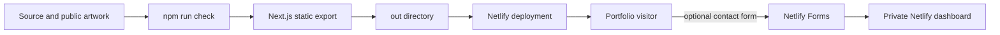

# Build and release workflow

Source control contains only code, documentation and intentionally public images. Generated output, local deployment state, environment files and private data are ignored by Git.
